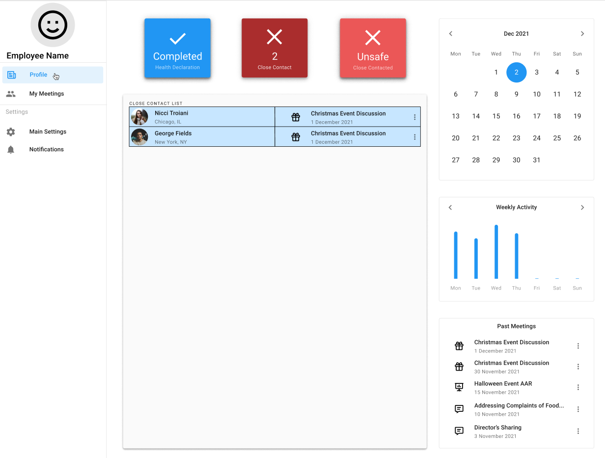

<h3 align="center">TraceTheGather</h3>

  <p align="center">
    TraceTheGather is a web application for companies to keep track of employee gatherings and meetings and carry out 
contact tracing in midst of the COVID-19 pandemic.
    <br />
    <a href="https://github.com/ZenoNexus/cs2102-project/blob/master/README.md"><strong>Explore the docs »</strong></a>
    <br />
  </p>

<!-- TABLE OF CONTENTS -->
<details>
  <summary>Table of Contents</summary>
  <ol>
    <li>
      <a href="#about-the-project">About The Project</a>
      <ul>
        <li><a href="#built-with">Built With</a></li>
      </ul>
    </li>
    <li>
      <a href="#getting-started">Getting Started</a>
      <ul>
        <li><a href="#prerequisites">Prerequisites</a></li>
        <li><a href="#installation">Installation</a></li>
      </ul>
    </li>
    <li><a href="#usage">Usage</a></li>
    <li><a href="#roadmap">Roadmap</a></li>
    <li><a href="#contributing">Contributing</a></li>
    <li><a href="#acknowledgments">Acknowledgments</a></li>
  </ol>
</details>

# About The Project
***
 
To curb the spread of COVID-19 in the workplace, companies have to monitor the health of employees and keep track of
close contacts of COVID-19 positive cases within the company. Given that this is a rather new process for companies, 
most of these processes are done manually. In order to improve productivity in the workplace, we have designed this web
application to help companies with the following:
* Keep track of departments within the company
* Keep track of employees within each department
* Remind employees to declare their temperature daily
* Provide alerts when an employee is having a fever
* Keep track of employees that are in contact during meetings
* Identify employees who have been in close contact with COVID-19 positive cases during meetings

### Built With
* [React.js](https://reactjs.org/)
* [Bootstrap](https://getbootstrap.com)
* [PostgreSQL](https://www.postgresql.org/)

# Getting started
***

### Prerequisites

* npm

Run `npm install` to get required packages. Run `npm start` and point `localhost:3000` to view development server.

### Installation
You will need to create an `.env` file to hide database credentials - This can be a new database, or if you still have the 2102 database you can just use that one. In the `.env` file:
* DB_USER=YOUR_USER       // should be postgres
* DB_HOST=127.0.0.1       // this represents localhost, we will migrate to an online db later
* DATABASE=YOUR_OWN_DB
* DB_PASSWORD=YOUR_OWN_PASSWORD
* DB_PORT=5432            //default I believe is 5432


## Using Postman (For BE testing of API calls)
You can download [Postman](https://www.postman.com/downloads/) here.
A sample query is shown below: 


This occurs cause of this line, and is just an example:
```
app.post('/user', (req, res) => {
    pool.query('SELECT * FROM departments', (error, results) => {
        if (error) {
          throw error
        }
        res.status(200).json(results.rows)
    })
})
```

## Usage

Use this space to show useful examples of how a project can be used. Additional screenshots, code examples and demos work well in this space. You may also link to more resources.

_For more examples, please refer to the [Documentation](https://example.com)_

<p align="right">(<a href="#top">back to top</a>)</p>


## Roadmap

- [] Feature 1
- [] Feature 2
- [] Feature 3
    - [] Nested Feature

See the [open issues](https://github.com/github_username/repo_name/issues) for a full list of proposed features (and known issues).

<p align="right">(<a href="#top">back to top</a>)</p>

## Contributing

Contributions are what make the open source community such an amazing place to learn, inspire, and create. Any contributions you make are **greatly appreciated**.

If you have a suggestion that would make this better, please fork the repo and create a pull request. You can also simply open an issue with the tag "enhancement".
Don't forget to give the project a star! Thanks again!

1. Fork the Project
2. Create your Feature Branch (`git checkout -b feature/AmazingFeature`)
3. Commit your Changes (`git commit -m 'Add some AmazingFeature'`)
4. Push to the Branch (`git push origin feature/AmazingFeature`)
5. Open a Pull Request

<p align="right">(<a href="#top">back to top</a>)</p>

## Acknowledgments

* []()
* []()
* []()

<p align="right">(<a href="#top">back to top</a>)</p>